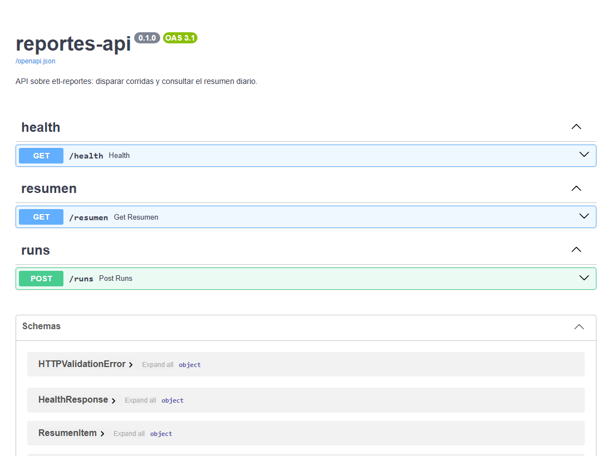
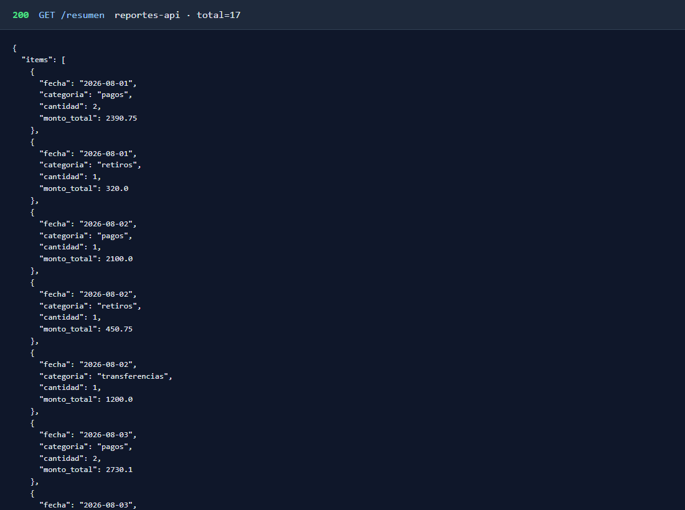

# Portafolio — Efrain Rivera Cadena

**Desarrollador backend** · Java · C# · Python · Node.js · CDMX  

[LinkedIn](https://www.linkedin.com/in/riveraec/) · [GitHub](https://github.com/riveraec) · [Perfil](perfil.md) · [Experiencia](experiencia.md)

Más de 6 años en APIs, microservicios e integración. Experiencia principal en **.NET**; trabajo reciente con **Java / Spring Boot** y **Python** (ETL, FastAPI). Sector financiero.

---

## Trayectoria

**Grupo financiero retail**

| Rol | Período | Stack |
|-----|---------|-------|
| Arquitecto de software | 2025 – presente | Java 21, Spring Boot, Gradle, AWS |
| Jefe de desarrollo | 2024 – 2025 | C#, .NET Core, IIS, microservicios |
| Desarrollador .NET senior | 2021 – 2024 | ASP.NET Web API, SQL Server, SSIS, Tableau |

**Rol actual**

- Desarrollo e integración de servicios Java/Spring en AWS (EC2, Lambda, RDS, secretos).
- Contratos REST/OpenAPI e integración entre servicios internos y externos.
- Estándares de capas, revisión de código y seguimiento de APIs en producción.

**Antes:** liderazgo de 3–5 personas; APIs .NET, SQL Server (SP, CTE, MERGE), ETL/SSIS y tableros Tableau. Detalle: [perfil.md](perfil.md).

---

## Lenguajes

| Lenguaje | Nivel | Experiencia |
|----------|-------|-------------|
| **C# / .NET** | Avanzado | 6+ años — APIs, microservicios, SQL Server |
| **Java / Spring Boot** | Intermedio-avanzado | Microservicios, bibliotecas, REST/SOAP |
| **Python** | Intermedio | ETL, FastAPI, automatización |
| **SQL** | Avanzado | CTE, MERGE, window functions, SP, índices, planes, ETL |
| **Node.js** | Intermedio | APIs con Express |

---

## Proyecto destacado — ETL y API

Pipeline que carga y resume datos; API que dispara corridas y consulta el resultado.

| Pieza | Repo | Descripción |
|-------|------|-------------|
| Pipeline | [etl-reportes](https://github.com/riveraec/etl-reportes) | CSV → pandas → SQLite, idempotencia por lote, resumen diario, pytest |
| API | [reportes-api](https://github.com/riveraec/reportes-api) | FastAPI: `POST /runs`, `GET /resumen`, health, OpenAPI, tests |

OpenAPI (`/docs`) y respuesta real de `GET /resumen` (total 17):

Local: venv + `pip install -e .` → `uvicorn reportes_api.main:app --reload` → `/docs` y `GET /resumen`.

---

## Otros proyectos

**Integración Java** — JWT, CRUD y cliente HTTP:

- [auth-api](https://github.com/riveraec/auth-api) · [productos-api](https://github.com/riveraec/productos-api) · [cliente-servicios-remotos](https://github.com/riveraec/cliente-servicios-remotos) (OpenFeign, retry, pool, WireMock)

**.NET** — [indicadores-api](https://github.com/riveraec/indicadores-api): .NET 8, EF Core, filtros, resumen, ProblemDetails, health, xUnit.

Más detalle: [perfil.md](perfil.md).

---

## Patrones

### Capas de una API REST

Controlador → servicio → repositorio → BD.

### Microservicio hexagonal

Dominio, adaptadores, APIs y persistencia.

### Flujo JWT

Login → token Bearer → recurso protegido. [auth-api](https://github.com/riveraec/auth-api).

### ETL y API

El pipeline carga datos; la API orquesta y consulta. [etl-reportes](https://github.com/riveraec/etl-reportes) · [reportes-api](https://github.com/riveraec/reportes-api).

---

## Stack

**Lenguajes:** Java 21, C#, Python, JavaScript, SQL  
**Frameworks:** Spring Boot, .NET / ASP.NET Web API, FastAPI, Express  
**Datos:** SQL Server, Oracle, SQLite, EF Core, LINQ, SSIS, Tableau, pandas · CTE, MERGE, window functions, SP, índices  
**Integración:** REST, SOAP, JWT, OpenAPI, OpenFeign  
**Herramientas:** Git, GitLab, Gradle, Maven, NuGet, Postman, Docker, AWS (EC2, Lambda, RDS)

---

## Qué busco

Desarrollador backend (Java o .NET), APIs, SQL y procesos de datos. CDMX o remoto.

[linkedin.com/in/riveraec](https://www.linkedin.com/in/riveraec/) · [github.com/riveraec](https://github.com/riveraec)

*Última actualización: agosto 2026*
