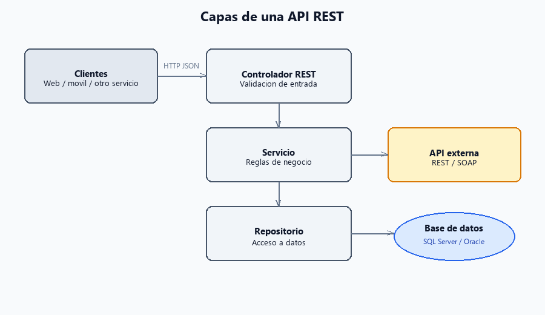
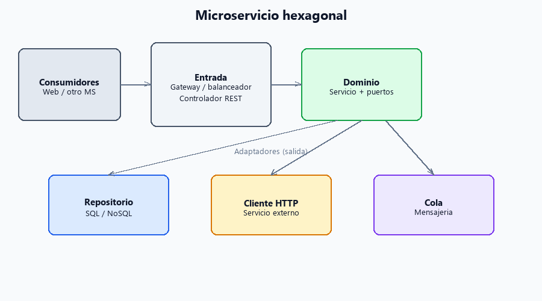
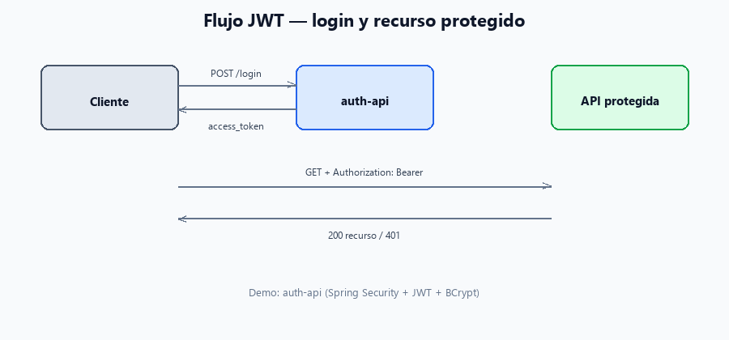
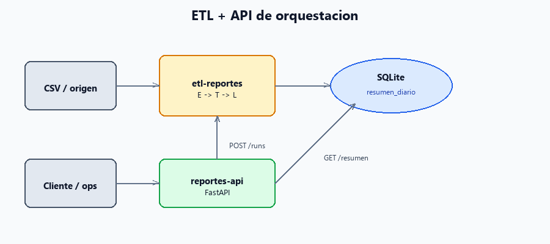

# Patrones

[← Volver al portafolio](README.md)

## Capas de una API REST

Controlador → servicio → repositorio → BD.

## Microservicio hexagonal

Dominio, adaptadores, APIs y persistencia.

## Flujo JWT

Login → token Bearer → recurso protegido. [auth-api](https://github.com/riveraec/auth-api).

## ETL y API

El pipeline carga datos; la API orquesta y consulta. [etl-reportes](https://github.com/riveraec/etl-reportes) · [reportes-api](https://github.com/riveraec/reportes-api).

[← Volver al portafolio](README.md)
